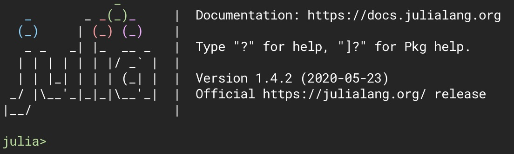

# Demonstrações da linguagem Julia



Repositório com demos de Julia e instruções de uso.

## Objetivo

Estamos aprendendo uma nova linguagem e comparando-a com linguagens tradicionais no meio da segurança da informação, como C e Python.

Neste repositório estamos colocando códigos simples em Julia para nos familiarizarmos com seu modo de operação.

## Instalando Julia

### Windows

Primeiro baixe o Julia em [https://julialang.org/downloads/](https://julialang.org/downloads/), após isso siga as instruções, este pacote vai instalar a linha de comando, bem como o console gráfico da linguagem.

### macOS

No macOS você pode instalar Julia facilmente com o [Homebrew](https://brew.sh/index_pt-br), rodando:

```bash
brew cask install julia
```

### Linux

Alguns gerenciadores de pacote possuem o pacote Julia, dependendo da sua distro você pode usar o comando adequado.

Por exemplo, nos sistemas com apt-get você pode usar o repositório `ppa:staticfloat/juliareleases` para fazer o download do pacote.

Caso prefira instalar o pacote direto ou fazer o build do fonte há o link oficial:

[https://julialang.org/downloads/](https://julialang.org/downloads/)

## Demos

- [helloworld](helloworld) - De acordo com a tradição, o primeiro código a se fazer depois de subir seu ambiente em Julia 😄.
- [arrays](arrays) - Mostra um pouco sobre como funcionam os arrays em Julia.

## Rodando um programa

Para rodar um programa/script com a linha de comando, basta usar:

```bash
julia programa.jl
```

## Links úteis

- [The Julia Language](https://julialang.org/) - Site da linguagem.
- [Julia Docs](https://docs.julialang.org/en/v1/) - Docs oficiais.
- [Julia VSCode](https://www.julia-vscode.org/) - Extensão legal para trabalhar com Julia no VS Code.
- [Jupyter](https://jupyter.org/) - IDE para trabalhar com Julia.
- [JuliaHub](https://juliahub.com/ui/Home) - Repositório específico para projetos em Julia.

## Autores

**The Crypters:**

- Guilherme Behs
- Guilherme Dietrich
- Matheus Kautzmann
- Vinícius Warken
